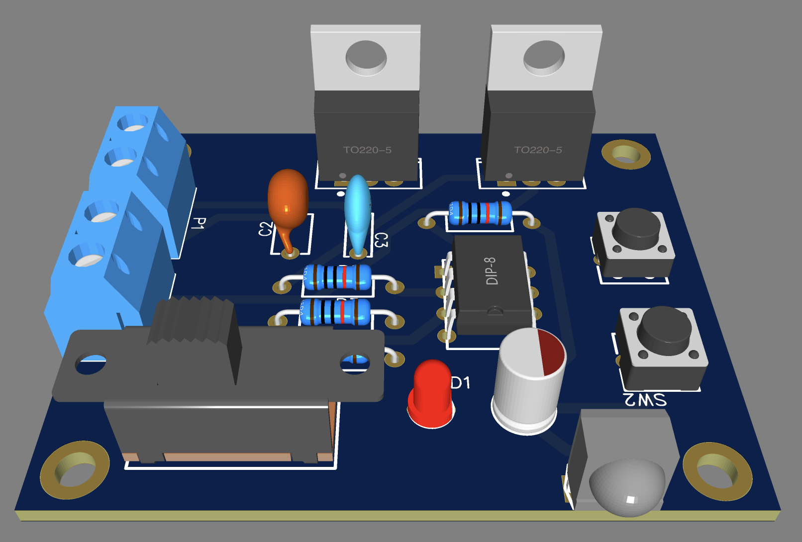
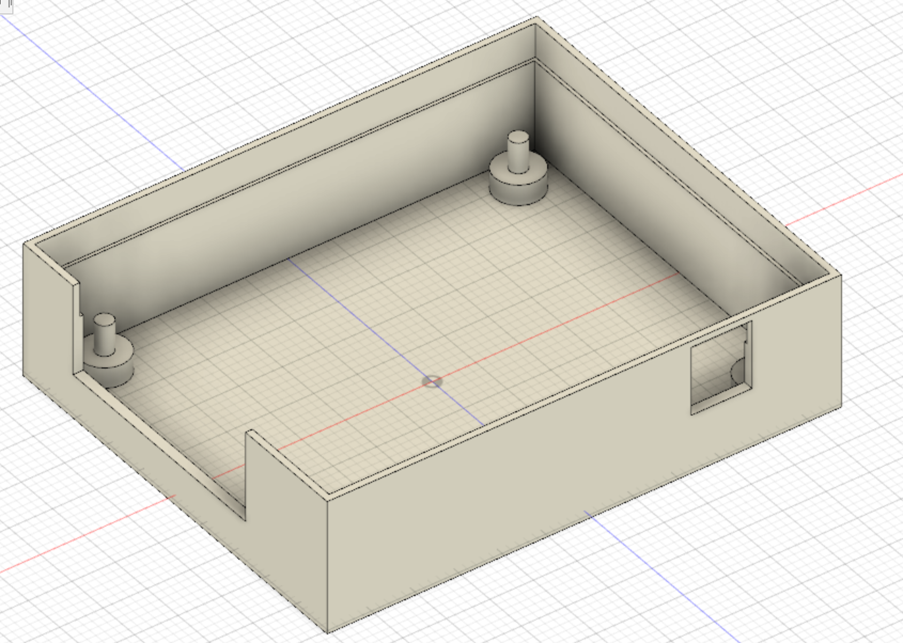
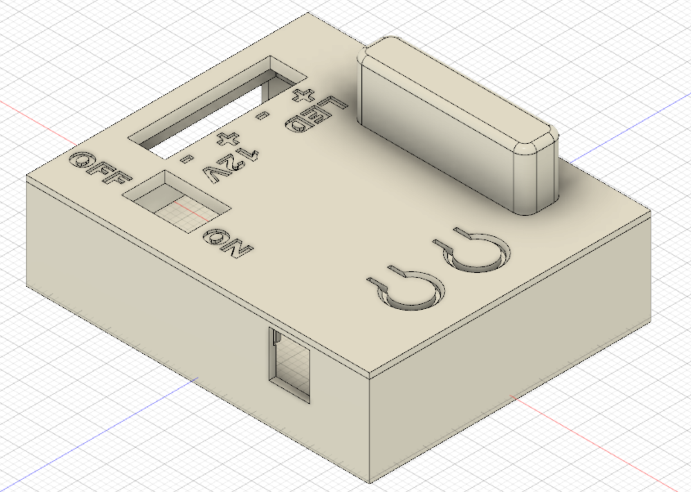

# attiny85-ir-remote-switch

Simple circuit used to create a programmable ir receiver to control a power mosfet as a led light switch.

### Hardware:
* AtTiny85
* Mosfet IRLB8721 (you can use any 5V mosfet)
* LM7805 as voltage regulator
* TSOP1836 as IR Receiver module
* capacitors (see schematic)
* resistors (see schematic)
* 2x tactile switches
* led (used to get feedback about IR command)
* 2x 2PIN connector (for mail voltage input and led strip output)

### PCB
in gerber folder you can find all files to create a working PCB

### 3D Case
in 3d_model folder you can find stl files about my 3D case design

